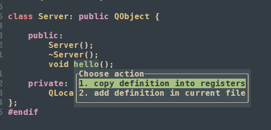

# coc-mantic

coc extension insprit c-mantic

用户可以决定将定义复制到剪切板还是文件中，该插件还在开发阶段应该还有很多没有考虑到的情况，只是提供了一种实现思路

## Install

```bash
:CocInstall coc-mantic
```

## features

- add definition in current file
- copy definition into registers


## requirements

1. coc.nvim


## usage


光标移动到函数声明处，使用coc.nvim默认的codeactions快捷键即可唤出codeaction列表




## develp


## License

MIT

---

> This extension is built with [create-coc-extension](https://github.com/fannheyward/create-coc-extension)
